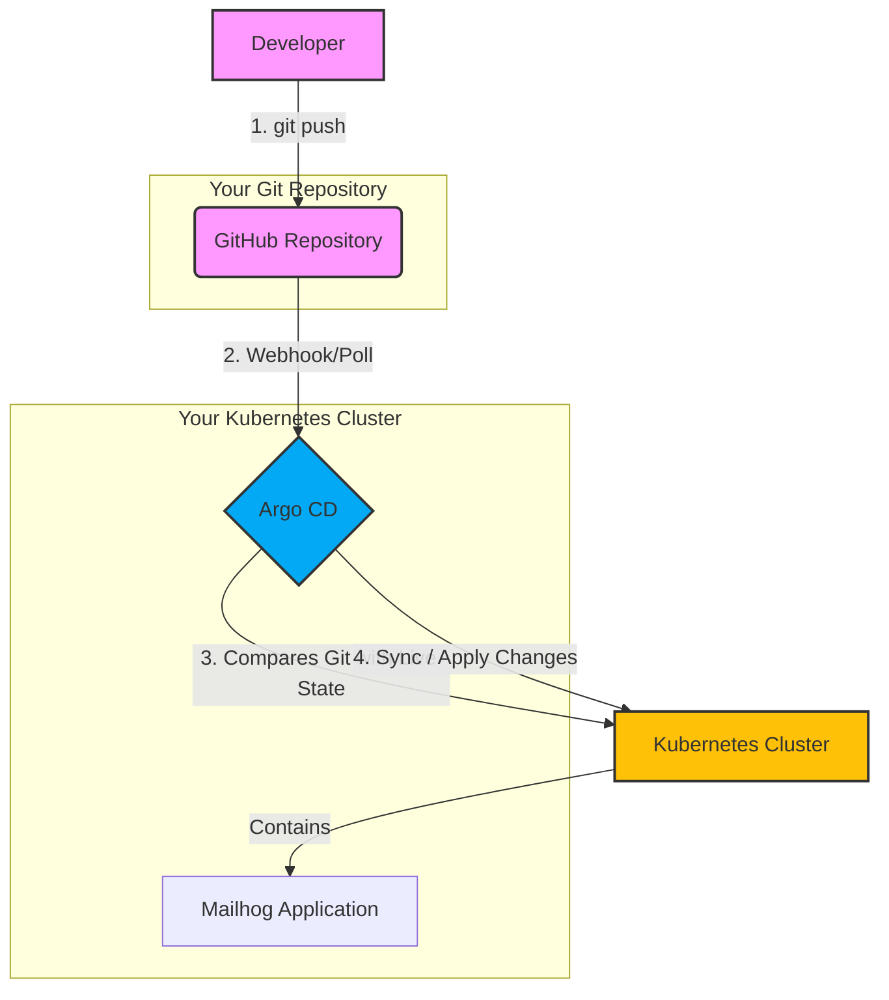

# Understanding the GitOps with Terraform and Argo CD Workshop

This document provides a clear explanation of the concepts, tools, and workflows covered in this workshop. It's designed for learners who may be new to these technologies.

---

### **What is this Workshop About?**

This workshop is a hands-on guide to implementing **GitOps**, a modern approach to deploying and managing software. You will learn how to automate the setup of a Kubernetes application (Mailhog) using a combination of powerful DevOps tools.

The core idea is to use a Git repository as the **single source of truth** for both your application's configuration and the infrastructure it runs on.

---

### **What You Will Learn**

By completing this workshop, you will gain practical experience in:

-   **Infrastructure as Code (IaC):** Using Terraform to programmatically define and create infrastructure (like a Kubernetes namespace and Argo CD itself).
-   **GitOps Principles:** Understanding how to use Git as the central point for managing your application's lifecycle.
-   **Continuous Delivery:** Automating the deployment of your application whenever changes are pushed to your Git repository.
-   **Configuration Management:** Using Kustomize to manage different configurations for various environments (like `dev` and `prod`) without duplicating code.

---

### **Core Concepts Explained**

Let's break down the key technologies used in this workshop:

#### **1. GitOps**

-   **What it is:** GitOps is a way of doing Continuous Delivery where Git is the center of your deployment pipeline. The desired state of your entire system (applications and infrastructure) is declared in a Git repository. An automated agent (in our case, Argo CD) ensures that the live environment always matches the state defined in the repository.
-   **Why it's important:** It makes your deployments more transparent, auditable, and easier to roll back. Every change is a `git commit`.

#### **2. Terraform**

-   **What it is:** Terraform is an **Infrastructure as Code (IaC)** tool. Instead of manually clicking through a web console to create servers or databases, you write code to define your infrastructure. Terraform then reads this code and builds that infrastructure for you on any cloud provider.
-   **In this workshop:** You use Terraform to install Argo CD on your Kubernetes cluster.

#### **3. Kubernetes**

-   **What it is:** Kubernetes (often called K8s) is an open-source platform for **container orchestration**. It automates the deployment, scaling, and management of containerized applications (like Docker containers). It's the foundation upon which all the other tools in this workshop operate.

#### **4. Argo CD**

-   **What it is:** Argo CD is a **declarative, GitOps continuous delivery tool** for Kubernetes. It constantly monitors your running applications and compares their live state against the desired state defined in your Git repository.
-   **If the live state is different from the Git repository, Argo CD will automatically correct it.** This ensures your application is always in the state you want it to be.

#### **5. Kustomize**

-   **What it is:** Kustomize is a tool for customizing Kubernetes configurations. It allows you to manage different versions of your application's configuration (e.g., for development, staging, and production) without copying and pasting YAML files. You have a `base` configuration, and then create `overlays` to define the differences for each environment.
-   **In this workshop:** You use Kustomize to manage the `dev` and `prod` configurations for Mailhog.

#### **6. Mailhog**

-   **What it is:** Mailhog is an **email testing tool**. It runs a fake SMTP server that captures any emails sent by your application, so you can view and test them in a web UI without sending them to real users.
-   **In this workshop:** It serves as the example application we are deploying.

---

### **The GitOps Workflow**

The following diagram illustrates the flow you are building in this workshop:

**Explanation of the flow:**

1.  A developer makes a change to the application's configuration (e.g., updating the number of replicas in `deployment.yaml`) and pushes the change to the GitHub repository.
2.  Argo CD, which is constantly monitoring the repository, detects that a change has been made.
3.  Argo CD compares the new configuration in Git with what is currently running in the Kubernetes cluster.
4.  It sees a difference and automatically "syncs" the cluster, applying the changes to match the new state defined in Git.

---

### **Why Are These Skills Important?**

The tools and practices in this workshop are highly sought after in the tech industry for roles like:

-   **DevOps Engineer:** Responsible for building and maintaining CI/CD pipelines and automating infrastructure.
-   **Cloud Engineer:** Manages and architects cloud infrastructure.
-   **Site Reliability Engineer (SRE):** Focuses on the reliability and automation of production systems.
-   **Software Engineer (with a DevOps focus):** Developers who are involved in the full lifecycle of their applications, including deployment and operations.

Mastering these skills will make you a more effective and valuable engineer in a modern, cloud-native world.

---

### **How to Go Further**

This workshop provides a solid foundation. To continue your learning journey, we highly recommend the **Bonus Challenges** in the `instruction.md` file:

-   Add a **prod overlay** to practice managing multiple environments.
-   Replace the raw YAML manifests with a **Helm chart**.
-   Implement **Sealed Secrets or SOPS** for managing sensitive information like passwords or API keys in a Git repository.
-   Configure **Argo CD Projects** to isolate different applications from each other.

### **Additional Resources**

-   **Argo CD:** [Official Documentation](https://argo-cd.readthedocs.io/)
-   **Terraform:** [Kubernetes Provider Documentation](https://registry.terraform.io/providers/hashicorp/kubernetes/latest/docs)
-   **Kustomize:** [Official Documentation](https://kustomize.io/)
-   **Mailhog:** [GitHub Repository](https://github.com/mailhog/MailHog)
-   **GitOps Guide:** [A Guide to GitOps](https://www.gitops.tech/)
